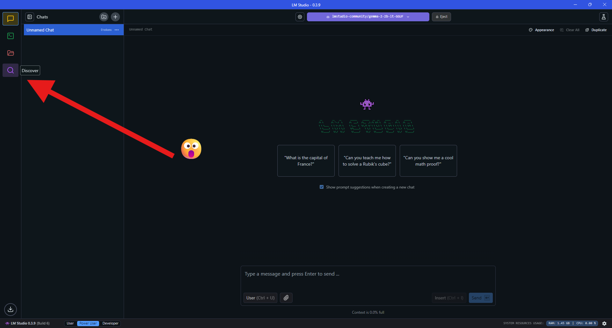
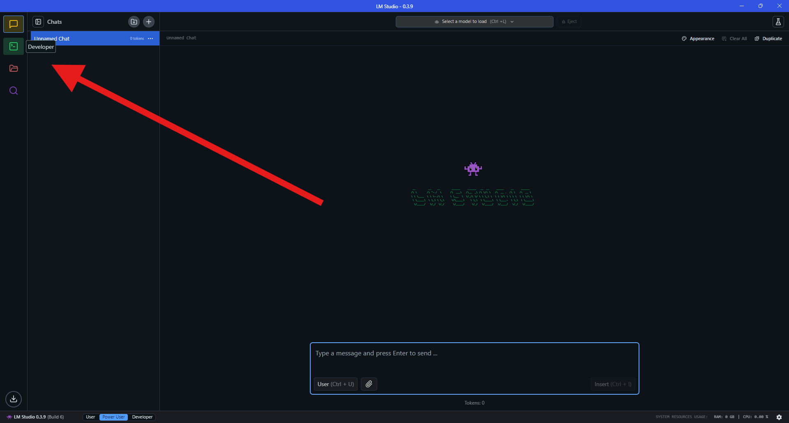

# CipherGPT

A trivia and problem solving arcade centered around LLM interaction in order to achieve victory

## Status

This game is under heavy development as the developers spend time learning the tools in the T3 stack and the specifics on how to make the LLM interaction experience better for the player.

Currently we have one working gamemode called **Emoji Trivia** where the user needs to guess the animal based only off the output of the LLM.

## Running the application

If you want to give CipherGPT a try, currently the only option is to run in developer mode. This setup might be slightly involved and will possibly require the installation of a couple tools used in development.

### Prerequisites

1. [Node.js](https://nodejs.org)

    Make sure to have `Node.js` on your system as wells as the node package manager `npm`. During development we used `npm version 11.1.0`, but anything past that will *most likely* also work.

2. A database URL

    During development we utilized the free plan provided by [Cockroach DB](https://www.cockroachlabs.com/).

    You will place the URL for your database in a `.env` file that looks exectly like `.env.example`.

    Then in `/prisma/schema.prisma`, your `datasource db` should look like:

    ```prisma
    datasource db {
        provider = "cockroachdb"
        url      = env("DATABASE_URL")
    }
    ```

#### LM Studio

Currently, the application depends on running another indenpendent application called [LM Studio](https://lmstudio.ai/).

Install LM Studio on your OS of choice.

To begin, make your way to the discover tag:

<p align="center">
    
</p>

1. Once there input `Gemma 2`
    > you can also use any model of your choosing, you will just have to change the spots in the code where `Gemma 2` is referenced to the LLM you chose

2. Select `Gemma 2 2B`
3. Download `Gemma 2 2B`

<p align="center">
    
</p>

Navigate to the `Developer` tab:

<p align="center">
    
</p>

1. Select `Gemma 2 2B` from the dropdown menu
2. Run the server
3. Open settings

<p align="center">
    
</p>

Make sure `Enable CORS` is enabled:

<p align="center">
    
</p>

### Actually Running the App

Once all the previous formalities are dealt with, you should be *almost* ready to go. Just a couple more steps:

1. Installing Dependencies

    In the command line enter:

    ```sh
    npm install
    ```

2. Run the app

    In the command line enter:

    ```sh
    npm run dev
    ```

The server should now be running on [Port 3000](http://localhost:3000).

## About the Developers
**Roan Morgan**, **Jonathan Attanasio**, and **Holden Roaten**

We are computer science students at the University of Tennessee pursuing this project for the Introduction to Software Engineering course. This project was made throughout an entire semester while also being in Systems Programming, one of the tougher classes for Comp Sci students at UTK. All the tech used in this project was new to us and allowed each of us to endure and experience the software engineering lifecycle in order to learn how to use software engineering tools present in Github (issues, milestones) in order to make the software development process go smoothly.